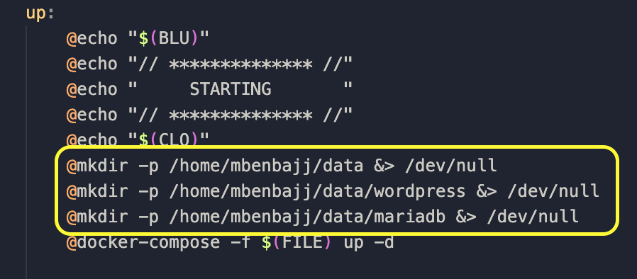
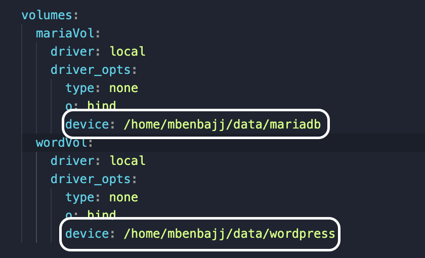

> # Inception

This project consists in having you set up a small infrastructure composed of different
services under specific rules. By containerizing serveral service and build their Docker images and create a network of containers. The project make in use Docker-compose. 

- The following containers are created:

#### Mandatory Part

* A Docker container with NGINX with TLSv1.2 or TLSv1.3 only
* A Docker container with WordPress + php-fpm
* A Docker container with MariaDB
* A volume that contains the WordPress database
* A second volume that contains the WordPress website files
* A docker-network that establishes the connection between the containers

#### Bonus part

1. Set up redis cache for your WordPress website in order to properly manage the cache
2. Create a simple static website in the language of your choice except PHP (Yes, PHP is excluded!). For example, a showcase site or a site for presenting your  resume
3. Set up Adminer
4. Set up a service of your choice that you think is useful. During the defense, you will have to justify your choice : Cadvisor

## Table of Contents

1. [X] [Docker](#Docker)
2. [X] [Docker Images](#docker-Images)
3. [X] [Docker Containers](#docker-Containers)
4. [X] [Docker Volumes](#docker-volumes)
5. [X] [Docker Network](#docker-network)
6. [X] [Docker Compose](#docker-compose)
7. [X] [NGINX Container](https://github.com/marbenMB/Inception/tree/master/srcs/requirements/nginx)
8. [X] [WordPress Container](https://github.com/marbenMB/Inception/tree/master/srcs/requirements/wordpress)
9. [X] [MariaDB Container](https://github.com/marbenMB/Inception/tree/master/srcs/requirements/mariadb)
1. [X] [Bonus-adminer Container](https://github.com/marbenMB/Inception/tree/master/srcs/requirements/bonus/adminer)
1. [X] [Bonus-cadvisor Container](https://github.com/marbenMB/Inception/tree/master/srcs/requirements/bonus/cadvisor)
1. [X] [Bonus-redis Container](https://github.com/marbenMB/Inception/tree/master/srcs/requirements/bonus/redis)
1. [X] [Bonus-staticsite Container](https://github.com/marbenMB/Inception/tree/master/srcs/requirements/bonus/static)

## Usage :

- To run this project you need to execute make command to the root of directory :
```bash
make
``````

- 🔴 But first you need to make some modification to make it work in your machine.
  - The volumes , you should modify the volume path to valid path in your machine, in the makefile and docker compose.
  
  
  

## Docker

 Docker is a software platform that allows you to create, deploy, and run applications inside containers. Containers are isolated environments that include all the necessary files and dependencies needed to run an application, making it easy to deploy and manage applications across different environments. Docker provides a standardized and reproducible way to package and distribute applications, making it easier for developers to create, test, and deploy their applications.

## Docker Images

A Docker image is a pre-built environment for running a containerized application, consisting of all necessary files, libraries, and configuration settings packaged into a single file system

## Docker Containers

A Docker container is a runnable instance of a Docker image, isolated from the host system and its resources, with its own file system, network, and process space.

## Docker Volumes

A Docker volume is a way to store data generated by and/or used by a Docker container, that persist even after the container is deleted. Volumes can be created and managed independently of containers, and can be used by multiple containers.

## Docker Network

A Docker network is a virtual network that connects Docker containers, allowing them to communicate with each other and the host system, as well as to isolate network traffic between containers.

## Docker Compose

Docker Compose is a tool for defining and running multi-container Docker applications, by using a YAML file to specify the services, networks, and volumes for an application, and to configure how they are connected and interact with each other. With Docker Compose, you can define an entire application stack in a single file, and then start and stop the entire stack with a single command.

## Diagram of the Expected Result

